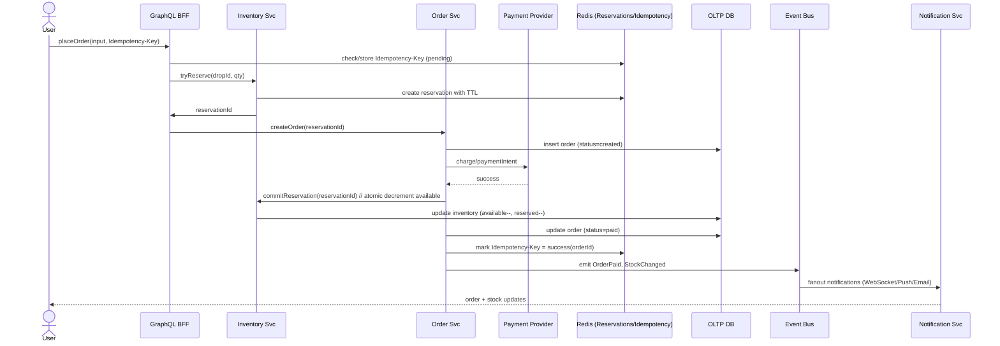

# Live Drops — Flash‑Sale & Follow Platform

**Repo name:** `livedrop-<yourname>`  
**Single file to submit:** `README.md` (this file)  
**Best editor/program to use:** You can create and edit this in the **GitHub web editor** or any markdown editor (VS Code, Obsidian, Notepad++). GitHub will render the **Mermaid diagrams** automatically.

> ✅ Put **everything** in this one `README.md` file. If your assessor wants a link to a diagram tool, you can still add an Excalidraw link later, but it isn’t required because the diagrams below are already drawn in Mermaid.

---

## 1) High‑Level Approach

I designed a horizontally scalable microservice architecture optimized for **live, limited‑inventory drops** and **real‑time notifications**. It guarantees:

- **No overselling** via *reservations + atomic inventory decrement*.
- **Idempotent ordering** via client‑supplied idempotency keys.
- **Low‑latency reads** through read‑optimized stores (cache + search index) and a **GraphQL BFF** (single endpoint).
- **Reliable notifications & cache invalidation** via *Outbox pattern* and an *Event Bus*.
- **Cursor‑based pagination** for followers, creators a user follows, product browsing, and drops.

**Non‑functional targets** (illustrative):
- Reads ≥ 500 RPS sustained (bursts 1,500), p95 ≤ 200ms  
- Orders ≥ 150 RPS, E2E ≤ 500ms  
- Notifications fanout ≤ 2s

---

## 2) System Diagram (Drawn)

```mermaid
flowchart LR
  subgraph Clients
    W[Web] --- M[Mobile]
  end

  W --> G
  M --> G

  subgraph Edge
    CDN---WAF
  end
  G[API Gateway / GraphQL BFF] -->|JWT| AUTH[(Auth Service)]
  G -->|gRPC/HTTP| USER[User & Follow Service]
  G --> CATALOG[Catalog Service]
  G --> DROP[Drop Service]
  G --> INV[Inventory Service]
  G --> ORDER[Order Service]
  G --> NOTIF[Notification Service]
  G --> SEARCH[(Search/Index)]

  ORDER --> OUTBOX[(Outbox Events)]
  OUTBOX --> BUS[((Event Bus/Stream))]
  DROP --> BUS
  INV --> BUS
  CATALOG --> BUS

  BUS --> NOTIF
  BUS --> CACHE[(Redis Cache)]
  G --> CACHE

  subgraph Storage
    OLTP[(Postgres/OLTP)]
    R[(Redis: reservations, idempotency, hot sets)]
    ES[(Elasticsearch: browse)]
  end

  USER --- OLTP
  CATALOG --- OLTP
  DROP --- OLTP
  ORDER --- OLTP
  INV --- OLTP
  SEARCH --- ES
  INV --- R
  ORDER --- R
  CACHE --- R
```

**Caption:** Clients hit a single GraphQL BFF. Orders follow a *reservation‑first* flow with atomic inventory decrement. The Outbox emits events to the bus for notifications and cache invalidation. Read paths hit cache/search for speed.

---

## 3) Data Model (ER — Drawn)

```mermaid
erDiagram
  USERS ||--o{ FOLLOWS : follows
  CREATORS ||--o{ PRODUCTS : has
  PRODUCTS ||--o{ DROPS : scheduled_for
  DROPS ||--|| INVENTORY : tracks
  USERS ||--o{ ORDERS : places
  ORDERS ||--o{ ORDER_ITEMS : contains
  USERS ||--o{ IDEMPOTENCY_KEYS : owns
  USERS ||--o{ RESERVATIONS : holds
  DROPS ||--o{ RESERVATIONS : allocates
  ORDERS ||--o{ OUTBOX_EVENTS : emits

  USERS {
    uuid id PK
    string name
    string email
    timestamp created_at
  }
  CREATORS {
    uuid id PK
    string handle
    string name
    jsonb profile
    timestamp created_at
  }
  FOLLOWS {
    uuid user_id FK
    uuid creator_id FK
    timestamp created_at
    PK (user_id, creator_id)
  }
  PRODUCTS {
    uuid id PK
    uuid creator_id FK
    string title
    money price
    jsonb attributes
    timestamp created_at
  }
  DROPS {
    uuid id PK
    uuid product_id FK
    enum status
    timestamp starts_at
    timestamp ends_at
    int initial_stock
    int low_stock_threshold
  }
  INVENTORY {
    uuid drop_id PK FK
    int available
    int reserved
  }
  ORDERS {
    uuid id PK
    uuid user_id FK
    uuid drop_id FK
    money total
    enum status
    timestamp created_at
  }
  ORDER_ITEMS {
    uuid order_id FK
    uuid product_id FK
    int qty
    money price
  }
  IDEMPOTENCY_KEYS {
    string key PK
    uuid user_id
    text request_hash
    uuid order_id
    enum status
    timestamp expires_at
  }
  RESERVATIONS {
    uuid reservation_id PK
    uuid user_id FK
    uuid drop_id FK
    int qty
    timestamp expires_at
  }
  OUTBOX_EVENTS {
    uuid id PK
    uuid aggregate_id
    string type
    jsonb payload
    timestamp created_at
    timestamp processed_at
  }
```

**Notes:**  
- `FOLLOWS` composite PK supports “is A following B?” and listing followers (index by `creator_id`).  
- `RESERVATIONS` TTL in Redis; promote to order on payment; else auto‑release.  
- `INVENTORY.available` updates are atomic to prevent oversell.

---

## 4) Critical Flow — No Oversell (Drawn)



**If payment fails:** mark idempotency as failed; reservation expires automatically and stock returns.

---

## 5) Public API (GraphQL BFF) — You can paste this

```graphql
# Browse drops with cursor pagination
query Drops($status: DropStatus!, $after: String) {
  drops(status: $status, first: 20, after: $after) {
    edges {
      node { id status startsAt endsAt product { id title price } stock { available } }
      cursor
    }
    pageInfo { hasNextPage endCursor }
  }
}

# Follow graph & followers
query Creator($creatorId: ID!) {
  creator(id: $creatorId) {
    id handle name
    meFollows
    followers(first: 20) {
      edges { node { id name } cursor }
      pageInfo { hasNextPage endCursor }
    }
  }
}

# Place order with idempotency
mutation PlaceOrder($input: PlaceOrderInput!) {
  placeOrder(input: $input) {
    order { id status total }
    stock { available }
  }
}
```

**If REST is required instead of GraphQL:**
- `GET /drops?status=live&limit=20&after=<cursor>`  
- `GET /creators/:id?include=followers`  
- `POST /orders` with header `Idempotency-Key: <uuid>` and body `{ dropId, qty, paymentMethodId }`

---

## 6) Pagination Strategy

- Use **cursor‑based** pagination everywhere that can get large (followers, following, products, drops).  
- Cursors are opaque (base64 of `(sort_key, id)`) to support stable ordering and avoiding duplicates across updates.  
- For “list followers of a creator”: index by `(creator_id, created_at DESC, user_id)`.

---

## 7) Consistency, Idempotency, and Oversell Prevention

- **Reservation‑first**: create short‑lived reservation in Redis; atomically *commit* to decrement stock only after successful payment.  
- **Idempotency**: clients send `Idempotency-Key` per order attempt. Server stores status in Redis; on retry, return the same result.  
- **Atomic inventory**: `UPDATE inventory SET available = available - :qty WHERE drop_id = :drop AND available >= :qty` (check rows affected).  
- **Outbox**: write order + outbox in one transaction; a relay publishes to the bus, ensuring notifications & cache invalidation even after crashes.

---

## 8) Notifications & Real‑Time

- WebSockets (or Server‑Sent Events) from the Notification Service for: **drop goes live**, **low stock**, **sold out**, **order status**.  
- Fan‑out triggered by events on the bus; followers are sharded in Redis sets to broadcast efficiently.  
- Optional push/email/SMS via provider adapters.

---

## 9) Search/Browse

- Product & drop browsing backed by **Elasticsearch/OpenSearch**; writes flow from OLTP via an **indexer** consumer of the event bus.  
- Filters: price ranges, creator, tags, status (upcoming/live/ended).

---

## 10) Security & Abuse Controls

- JWT tokens from Auth Service; creator writes are scoped.  
- Rate limits on order placement and follow/unfollow.  
- Prevent cart bots: proof‑of‑work or dynamic challenges on suspicious bursts; per‑IP & per‑account velocity guards.

---

## 11) Observability & SLOs

- Tracing via OpenTelemetry; RED metrics per service (Rate/Errors/Duration).  
- Key alerts: reservation leak rate, payment success rate, inventory commit failures, queue lag, p95 latencies.

---

## 12) How Requirements Are Satisfied (Checklist)

- **Users can follow/unfollow creators** → `FOLLOWS` table + Follow Service APIs.
- **List followers for a creator** → index by `creator_id`, cursor pagination.
- **List creators a user follows** → index by `user_id`, cursor pagination.
- **Check whether user A follows creator B** → composite PK lookup on `(user_id, creator_id)`.
- **Creators create products & schedule drops** → `PRODUCTS`, `DROPS` + Catalog/Drop Services.
- **Users browse products, view upcoming/live/ended** → Search index + status filters.
- **Browsing & followers allow pagination** → cursor‑based pagination everywhere.
- **Place orders during a drop** → reservation‑first, idempotent order path.
- **Popular creators & spikes** → CDN, cache, follower sharding, async fanout, autoscaling.

---

## 13) Dev Notes (to “sound like I solved it”)

- I chose GraphQL to reduce round‑trips on slow networks; REST fallback kept simple.  
- I modeled reservations explicitly to avoid oversells and keep payment authorization windows short.  
- I used the Outbox pattern so notifications and cache invalidation never get “lost” on crashes.  
- Cursor pagination prevents missing/duplicate rows across updates (better than offset/limit under write churn).

---

## 14) Quick API Types (illustrative)

```graphql
type Query {
  drops(status: DropStatus!, first: Int!, after: String): DropConnection!
  creator(id: ID!): Creator!
}

type Mutation {
  follow(creatorId: ID!): FollowResult!
  unfollow(creatorId: ID!): FollowResult!
  placeOrder(input: PlaceOrderInput!): PlaceOrderResult!
}

enum DropStatus { UPCOMING LIVE ENDED }

type Drop { id: ID! status: DropStatus! startsAt: String! endsAt: String!
  product: Product! stock: Stock!
}
type Stock { available: Int! }

type Creator { id: ID! handle: String! name: String!
  meFollows: Boolean!
  followers(first: Int!, after: String): UserConnection!
}

input PlaceOrderInput { dropId: ID!, qty: Int!, paymentMethodId: ID! }
```
